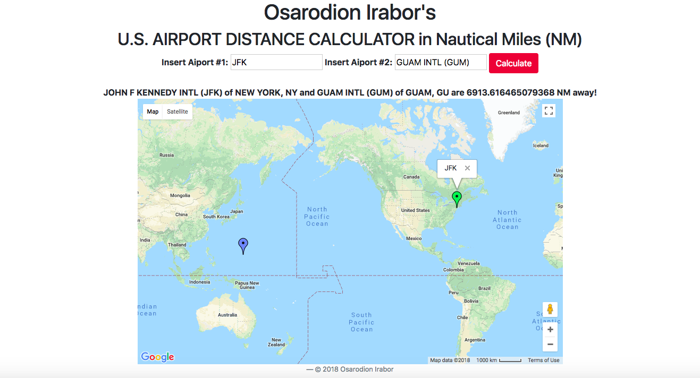

Airport Distance Calculator
============
> A containerized web app that calculates the distance between two U.S. airports in nautical miles.

> Featured with Autocompletion functionality and Google maps plotting.

Installation
--------
* Docker 18.06.0+ Must Be Installed on Host before running this Web App 

- Run ```docker-compose up``` to run the app 

The app is app.py.
The database ```airport.db in sqlite3```

**If the images associated with the docker-compose and Dockerfile files are not available on your host computer, 
docker will pull these images and it will take some time to have them fully pulled to your host computer.**
**After that any** ```docker-compose up``` **commands will run the containers right away.**

- Run ```docker-compose down``` to stop and remove the containers and the network.

**The images, however, will still stay on your computer unless you want to remove them.** 

The app will be running on http://127.0.0.1:5004/ or http://localhost:5004/

Sample Image of Results
---------
### *Calculated Distance between JFK and GUM*


Tech 
------
* [flask]
* [wtforms]
* [flask-googlemaps]
* [Jinja2]
* [Google Maps Javascript API]
* [jQuery]
* [Docker]
* [Docker-Compose]

Author
--------
* Osarodion Irabor

License
-------
MIT

[Federal Aviation Administration]: https://www.faa.gov/airports/airport_safety/airportdata_5010/
[flask]: http://flask.pocoo.org/
[flask-googlemaps]: https://github.com/rochacbruno/Flask-GoogleMaps
[wtforms]: https://github.com/wtforms/wtforms
[Google Maps Javascript API]: https://developers.google.com/maps/documentation/javascript/tutorial
[Jinja2]: http://jinja.pocoo.org/docs/2.10/
[jQuery]: https://api.jquery.com/
[Docker]: https://docs.docker.com/engine/reference/builder/#usage
[Docker-Compose]: https://docs.docker.com/compose/compose-file/
